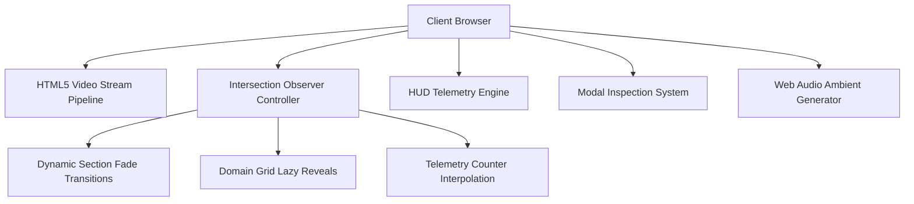

# Odean Aerospace Architecture & Design Specification 📐

## System Architecture

The Odean Aerospace web application is designed with high-performance client-side rendering principles, optimizing for high-resolution video streaming, smooth 60fps animations, and zero heavy framework overhead.

## Core Modules

1. **Cinematic Viewport Manager**:
   - Manages layered HTML5 video tags with CSS `object-fit: cover`.
   - Utilizes `IntersectionObserver` thresholds to smoothly blend active and inactive video plates based on user scroll velocity.

2. **Telemetry & HUD Controller**:
   - Pure CSS hardware-accelerated animations with subtle cyan glowing drop-shadows.
   - Numeric counters with ease-out cubic interpolation.

3. **Interactive Inspection Modal**:
   - Zero-dependency modal overlay with backdrop filter blur (`backdrop-filter: blur(12px)`).
   - High-fidelity asset resolution matching.

4. **Web Audio Sound Synthesizer**:
   - Native Web Audio API ambient drone synthesizer simulating high-altitude cockpit ambience without external media latency.